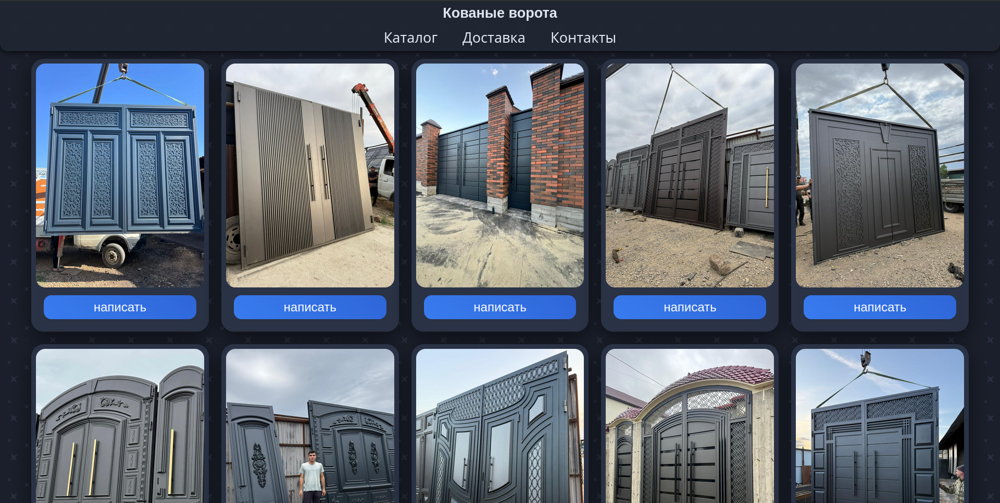
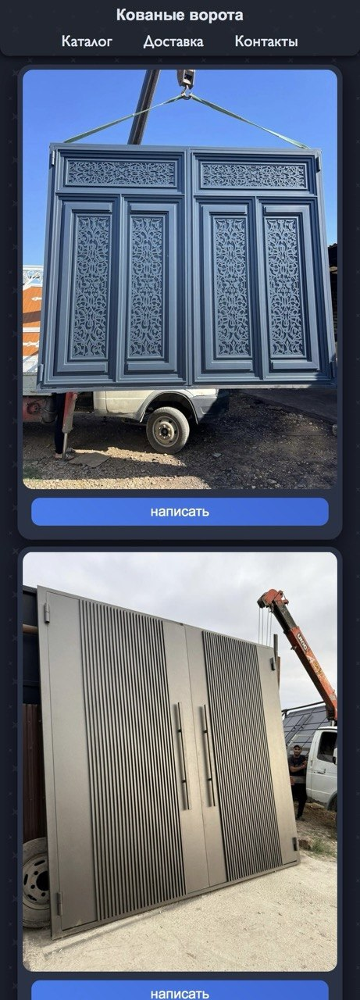

# Doorix React

## Обзор

Doorix React — это сайт, предназначенный для упрощения взаимодействия между клиентом и исполнителем услуг.
Проект представляет собой практичный интерфейс, позволяющий пользователям просматривать услуги, получать информацию и быстро устанавливать контакт.

Цель проекта — создать лёгкий, понятный и доступный инструмент взаимодействия бизнеса и клиента без лишней сложности.

---

## Демо

[Открыть сайт](https://xh3t4g.github.io/Doorix-React/)

Рекомендуется проверить:

* навигацию между страницами
* просмотр услуг
* адаптивное поведение интерфейса

---

## Возможности

* каталог услуг
* интерфейс взаимодействия клиент–исполнитель
* адаптивный дизайн
* модульная структура компонентов
* быстрая навигация страниц

---

## Технологический стек

* React
* Vite
* JavaScript
* CSS Modules
* HTML5

---

## Архитектура

Проект построен на компонентном подходе:

* `components/` — переиспользуемые UI-компоненты
* `pages/` — страницы сайта
* `assets/` — статические ресурсы
* `styles/` — модульные стили

Логика интерфейса отделена от представления для повышения предсказуемости и переиспользуемости компонентов.

---

## Установка

```bash
git clone https://github.com/xh3t4g/Doorix-React.git
cd Doorix-React
npm install
npm run dev
```

---

## Скриншоты





---

## Статус проекта

Текущая версия функциональна и может использоваться как лёгкий сайт для взаимодействия клиента и исполнителя.

Планируемые улучшения:

* интеграция backend
* валидация форм
* сохранение данных
* оптимизация производительности

---

## Полученный опыт

* переход от Vanilla JavaScript к архитектуре React
* декомпозиция компонентов
* организация структуры проекта
* работа со сборщиком Vite

---

## Автор

GitHub: https://github.com/xh3t4g
